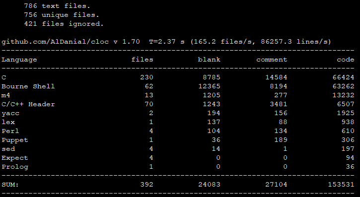

# sudo-1.8.29 学习笔记

```
Something I hope you know before go into the coding~
First, please watch or star this repo, I'll be more happy if you follow me.
Bug report, questions and discussion are welcome, you can post an issue or pull a request.
```


## 软件包信息

```
[root@rocky-clion ~/rpmbuild]# yum info sudo
Last metadata expiration check: 2:26:53 ago on Thu 30 Jun 2022 08:31:42 AM CST.
Installed Packages
Name         : sudo
Version      : 1.8.29
Release      : 8.el8
Architecture : x86_64
Size         : 3.4 M
Source       : sudo-1.8.29-8.el8.src.rpm
Repository   : @System
From repo    : anaconda
Summary      : Allows restricted root access for specified users
URL          : https://www.sudo.ws/
License      : ISC
Description  : Sudo (superuser do) allows a system administrator to give certain
             : users (or groups of users) the ability to run some (or all) commands
             : as root while logging all commands and arguments. Sudo operates on a
             : per-command basis.  It is not a replacement for the shell.  Features
             : include: the ability to restrict what commands a user may run on a
             : per-host basis, copious logging of each command (providing a clear
             : audit trail of who did what), a configurable timeout of the sudo
             : command, and the ability to use the same configuration file (sudoers)
             : on many different machines.

[root@rocky ~/rpmbuild]# rpm -ql sudo
/etc/dnf/protected.d/sudo.conf
/etc/pam.d/sudo
/etc/pam.d/sudo-i
/etc/sudo-ldap.conf
/etc/sudo.conf
/etc/sudoers
/etc/sudoers.d
/usr/bin/cvtsudoers
/usr/bin/sudo
/usr/bin/sudoedit
/usr/bin/sudoreplay
/usr/lib/tmpfiles.d/sudo.conf
/usr/libexec/sudo
/usr/libexec/sudo/group_file.so
/usr/libexec/sudo/libsudo_util.so
/usr/libexec/sudo/libsudo_util.so.0
/usr/libexec/sudo/libsudo_util.so.0.0.0
/usr/libexec/sudo/sesh
/usr/libexec/sudo/sudo_noexec.so
/usr/libexec/sudo/sudoers.so
/usr/libexec/sudo/system_group.so
/usr/sbin/visudo
/usr/share/doc/sudo
/usr/share/doc/sudo/CONTRIBUTORS
/usr/share/doc/sudo/HISTORY
/usr/share/doc/sudo/NEWS
/usr/share/doc/sudo/README
/usr/share/doc/sudo/README.LDAP
/usr/share/doc/sudo/TROUBLESHOOTING
/usr/share/doc/sudo/UPGRADE
/usr/share/doc/sudo/examples
/usr/share/doc/sudo/examples/pam.conf
/usr/share/doc/sudo/examples/sudo.conf
/usr/share/doc/sudo/examples/sudoers
/usr/share/doc/sudo/examples/syslog.conf
/usr/share/doc/sudo/schema.ActiveDirectory
/usr/share/doc/sudo/schema.OpenLDAP
/usr/share/doc/sudo/schema.iPlanet
/usr/share/doc/sudo/schema.olcSudo
/usr/share/licenses/sudo
/usr/share/licenses/sudo/LICENSE
/usr/share/man/man1/cvtsudoers.1.gz
/usr/share/man/man5/sudo-ldap.conf.5.gz
/usr/share/man/man5/sudo.conf.5.gz
/usr/share/man/man5/sudoers.5.gz
/usr/share/man/man5/sudoers.ldap.5.gz
/usr/share/man/man5/sudoers_timestamp.5.gz
/usr/share/man/man8/sudo.8.gz
/usr/share/man/man8/sudoedit.8.gz
/usr/share/man/man8/sudoreplay.8.gz
/usr/share/man/man8/visudo.8.gz
/var/db/sudo
/var/db/sudo/lectured
```



* 官网 : <https://www.sudo.ws/>


## 目录


* [CVE](docs/CVE.md)
  - [CVE-2021-3156](docs/CVE/CVE-2021-3156.md)


---
